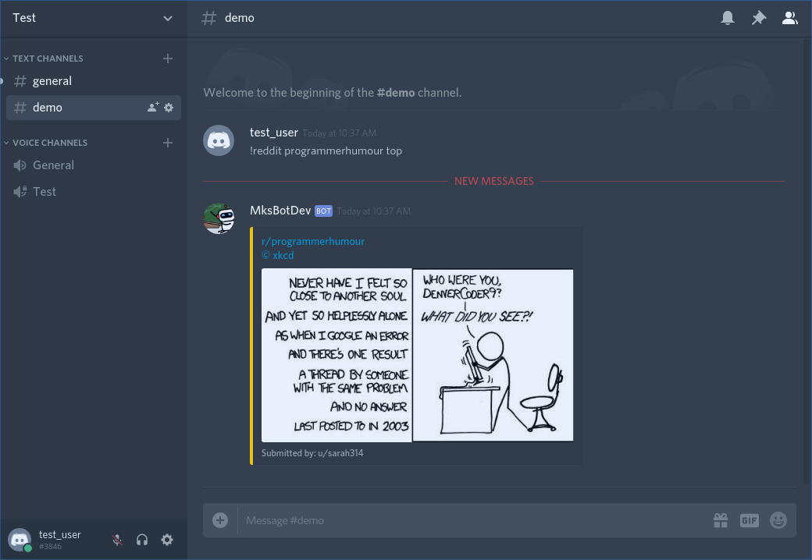
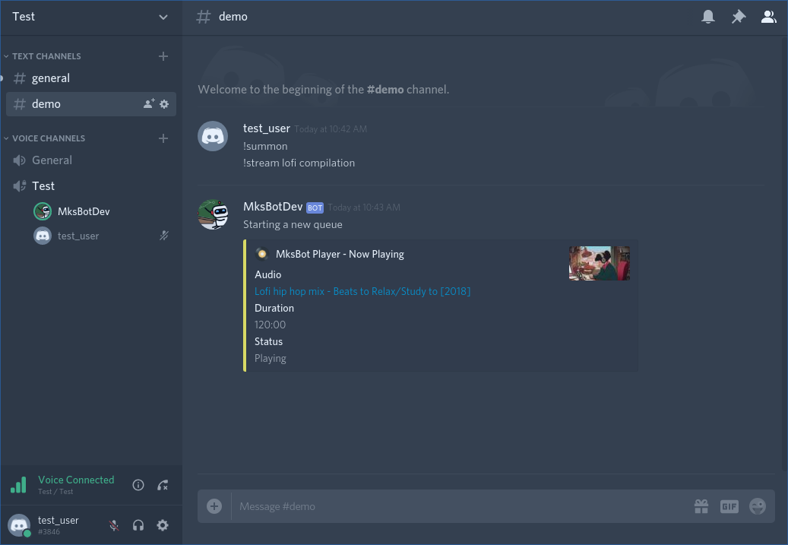
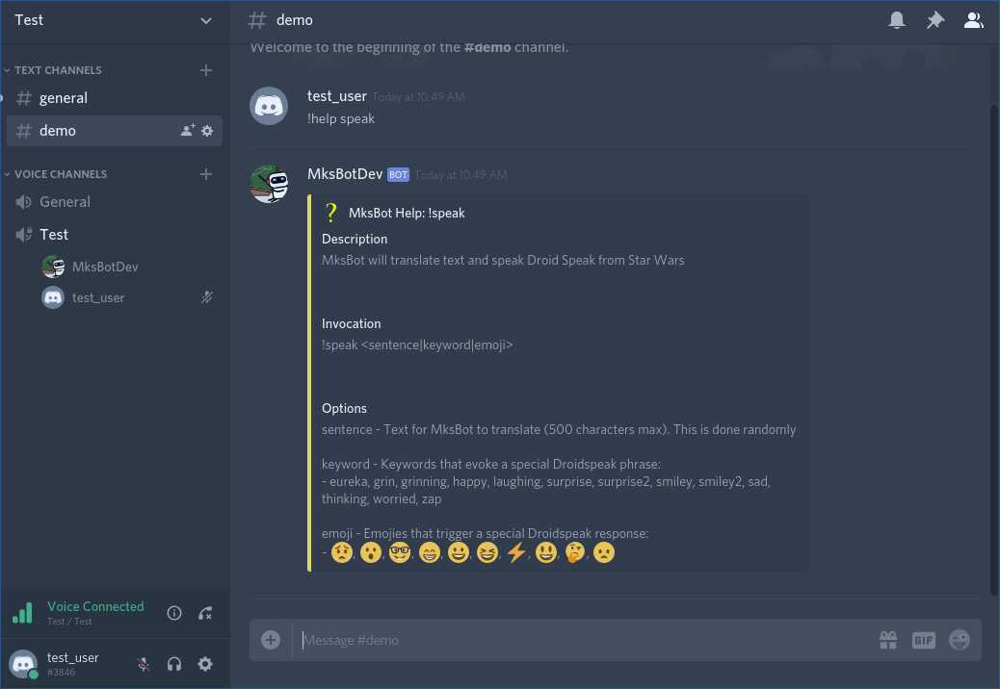

# MksBot - Observing gamers in their natural habitat

MksBot is my Python implementation of a Discord bot. Currently, he works on a single server to entertain my friends and
I. As a general purpose bot, MksBot can work as media player, message formatter and can perform basic admin tasks. He 
is also fluent in Droidspeak.  

I have no plans to enable other discord channels to access MksBot. He was designed to give my Discord channel a more 
custom feel and I work on this project to learn new tools and methods in Python (such as writing asynchronous methods).
Besides, the poor fella runs on a Raspberry Pi under a network with a VDSL internet connection. 

However, feel free to download him yourself or make use of his Cogs (inside of `cogs`) to add to your own bot.

## Features

Some of MksBot's features:

- Youtube and local audio streaming (with basic playback and queueing capabilities).

- Reddit web scraping using the PRAW module with multiple formats supported (gifs/images, links and reddit hosted 
media).

- Droid speak TTS and special responses (for the Star Wars nerds).

- Customized `!help`  with documentation for each command that specifies command syntax, parameters and default
behaviour.

## Dependencies

MksBot requires the following:

- [discord.py](https://github.com/Rapptz/discord.py/tree/rewrite) v1.0.0 or higher (with voice extension)
- ffmpeg (for audio file conversion and streaming)
- All reddit module dependencies provided in `requirements.txt` (use `pip install -r requirements.txt` to install them)

These packages themselves may require further dependencies depending on what OS you are using. MksBot has been tested
on Linux (specifically Raspbian Stretch and Ubuntu 18.04) as well as Windows 10 Home.

Please note that I use the rewritten (1.0.0) version of [discord.py](https://github.com/Rapptz/discord.py/tree/rewrite).
The rewrite is **not** compatible with older versions of the library.

## Installation

If you really want to install a copy of MksBot. You will need a YAML configuration file containing the important
credentials and settings required to run the source as it provided. I plan to improve how configuration works on the bot
but for now, a template `config-template.yml` has been provided for you to fill in. Be sure to rename
`config-template.yml` to `config.yml`.

## Screenshots

**Formatted Reddit posts**

**Youtube audio player**

**Command Documentation**
